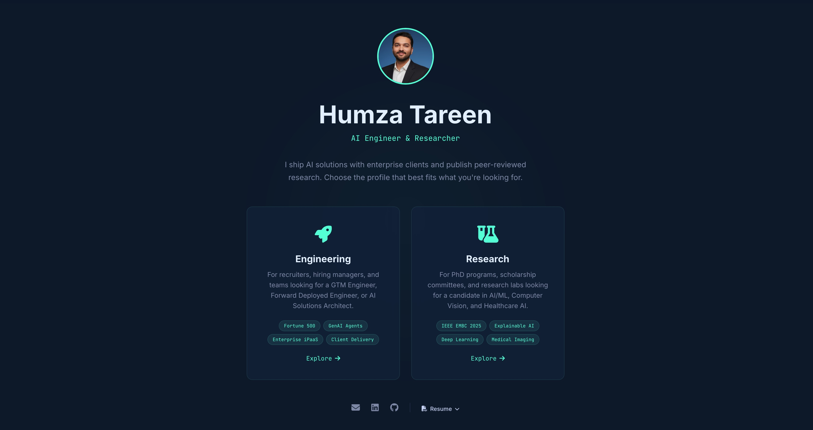

# humzakt.github.io

Personal portfolio website for **Humza Tareen** — AI Engineer & Researcher.

**Live:** [humzakt.github.io](https://humzakt.github.io)

## Overview

A portfolio that serves two distinct audiences from a single link. Visitors choose the profile that fits what they're looking for:

- **Engineering** — For recruiters, hiring managers, and teams looking for a GTM Engineer, Forward Deployed Engineer, or AI Solutions Architect.
- **Research** — For PhD programs, scholarship committees, and research labs looking for a candidate in AI/ML, Computer Vision, and Healthcare AI.

## Screenshots

### Landing Page



### Engineering Portfolio


### Research Profile


## Features

- **Audience-Targeted Content** — Two tailored pages with distinct copy, section ordering, and emphasis
- **Resume Dropdown** — View in browser or download directly
- **Responsive Design** — Mobile-first with fluid typography and layouts
- **Accessible** — ARIA attributes, keyboard navigation, skip-to-content, focus management
- **SEO Optimized** — Sitemap, robots.txt, JSON-LD structured data, Open Graph & Twitter Cards, canonical URLs
- **Scroll Animations** — IntersectionObserver-powered fade-ins and metric counters
- **Dynamic Copyright** — Auto-updates to the current year
- **Custom 404 Page** — Branded error page with navigation back to the site

## Tech Stack

- **HTML5 / CSS3 / JavaScript** — No frameworks, no build tools
- **CSS** — Grid, Flexbox, custom properties, `clamp()`, `backdrop-filter`, `prefers-reduced-motion`
- **Fonts** — [Inter](https://fonts.google.com/specimen/Inter) + [JetBrains Mono](https://fonts.google.com/specimen/JetBrains+Mono) via Google Fonts
- **Icons** — [Font Awesome 6](https://fontawesome.com/)
- **Hosting** — [GitHub Pages](https://pages.github.com/)
- **Built with** — [Cursor](https://cursor.com) (AI-native IDE)

## Project Structure

```
├── index.html              # Landing page (audience selector)
├── engineering.html         # Engineering / GTM / FDE portfolio
├── research.html            # Research / PhD profile
├── styles.css               # Shared design system
├── 404.html                 # Custom error page
├── suit-blue-bg.jpg         # Profile photo
├── HumzaTareen_Resume.pdf   # Downloadable resume
├── sitemap.xml              # SEO sitemap
├── robots.txt               # Search engine directives
├── screenshots/             # Screenshots for README
│   ├── main.jpg
│   ├── engineering page.jpg
│   └── research page.jpg
└── HumzaTareen_Resume/      # LaTeX resume source
    └── professional_developer_template/
        ├── main.tex
        └── resume_config.cls
```

## Local Development

No build step required. Just open any `.html` file in a browser, or serve locally:

```bash
# Using Python
python3 -m http.server 8000

# Using Node
npx serve .
```

## Deployment

The site deploys automatically to [humzakt.github.io](https://humzakt.github.io) via GitHub Pages from the `gh-pages` branch.

```bash
git push origin gh-pages
```

## Contact

- **Email:** humzakhawartareen@gmail.com
- **LinkedIn:** [linkedin.com/in/humzakt](https://www.linkedin.com/in/humzakt)
- **GitHub:** [github.com/humzakt](https://github.com/humzakt)

---

Designed & Built by Humza Tareen with [Cursor](https://cursor.com)
